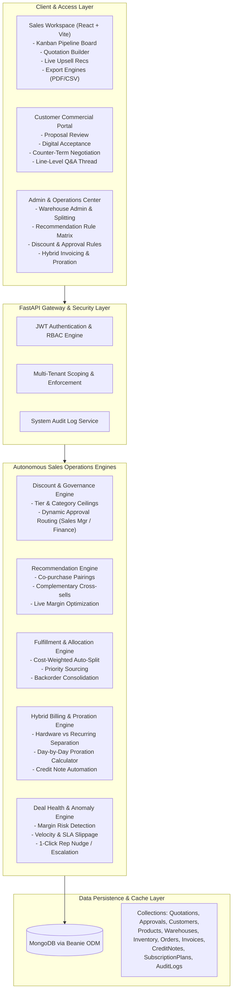
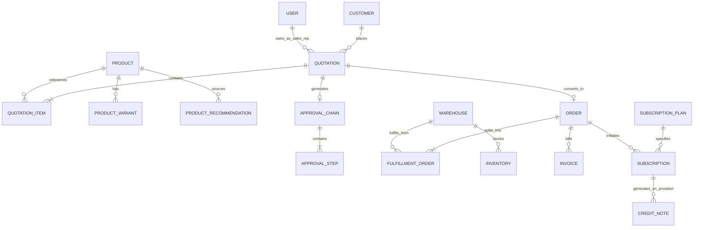

# DealFlow360 Architecture Specification

> **DealFlow360**: An intelligent, self-governing B2B Sales Operations Platform designed for multi-tier discount governance, live co-purchase recommendations, multi-warehouse fulfillment splitting, hybrid billing with automated proration, deal velocity health intelligence, and interactive customer negotiation.

---

## 1. System Architecture Diagram

---

## 2. Core Subsystems & Engines

### A. Multi-Tier Discount & Governance Engine
- **Customer Tier Ceilings**: Enterprise (25%), Partner (20%), Standard (10%), etc.
- **Dynamic Approval Escalation**:
  - *Within ceiling*: Automatically approved (Level 0).
  - *Exceeds customer ceiling*: Escalates to Sales Manager (Level 1).
  - *Severe breach or negative margin*: Multi-stage escalation through Sales Manager to Finance Director (Level 2).
- **Separation of Duties**: Sales reps cannot approve their own submitted quotations.

### B. Live Upsell & Cross-Sell Recommendation Engine
- **Co-Purchase Pairing Knowledge Graph**: Real-time evaluation of quotation contents against configured upsell pairings.
- **Priority Scoring & Margin Expansion**: Ranks recommendations based on margin delta and relevance.
- **Instant Append**: 1-click addition directly from the builder UI into active quotes.

### C. Multi-Warehouse Fulfillment & Cost-Weighted Split Engine
- **Intelligent Auto-Split**: When a single facility cannot fulfill an order, automatically calculates split backorders.
- **Cost-Weighted Routing**: Factored by `shipping_cost_per_kg` and `priority_weight` across regional distribution centers.
- **Backorder Consolidation Prompt**: When mid-cycle stock arrives, triggers a 1-click consolidation action to merge shipments and save logistics overhead.

### D. Hybrid Billing & Proration Engine
- **Separation of Upfront Hardware & Recurring Software Lines**: Automatic split on invoices with distinct revenue recognition.
- **Day-by-Day Mid-Cycle Proration**: Computes exact unused subscription values upon plan upgrade, downgrade, or cancellation.
- **Automated Credit Notes**: Generates formal `CreditNote` audit documents and credits customer accounts instantly.

### E. Deal Health & Risk Intelligence
- **Composite Deal Health Score**: Evaluates quotation margin, stall velocity, customer negotiation iterations, and SLA status.
- **Delivery SLA Tracking**: Flags delivery promise slippage (`ON_TIME`, `AT_RISK`, `DELAYED`).
- **1-Click Interventions**:
  - **Nudge Rep**: Dispatches automated velocity warning to rep.
  - **Escalate Deal**: Elevates stalled deals directly to senior management.

---

## 3. Data Model & Entity Relationship

---

## 4. Security & Multi-Tenancy
- **Role-Based Access Control (RBAC)**: `ADMIN`, `SALES_REP`, `SALES_MANAGER`, `FINANCE`, `FULFILLMENT_LEAD`.
- **Tenant Scoping**: All queries filter by `seller_id` or seller tenant reference.
- **Tamper-Evident Audit Logging**: Every price override, approval sign-off, proration refund, and warehouse dispatch logs an irreversible entry in `audit_logs`.
