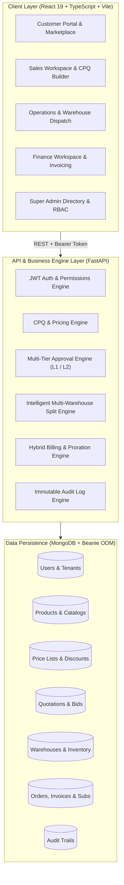
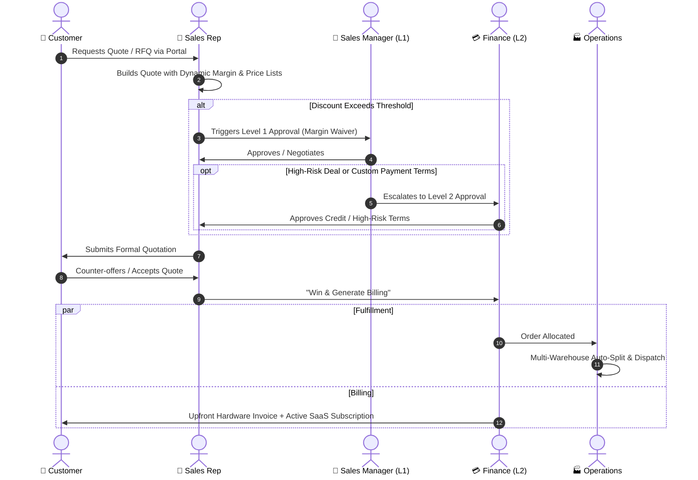

# ⚡ DealFlow360

<div align="center">

**Intelligent B2B Sales Operations & CPQ Platform**  
*Streamlining quotations, multi-tier approvals, multi-warehouse split fulfillment, hybrid billing, and customer negotiations.*

[](https://fastapi.tiangolo.com)
[](https://python.org)
[](https://www.mongodb.com)
[](https://react.dev)
[](https://www.typescriptlang.org)
[](https://vitejs.dev)
[](https://tailwindcss.com)
[](https://opensource.org/licenses/MIT)

[Live Workspaces](#-multi-tenant-workspaces--personas) • [Architecture](#-platform-architecture) • [Features](#-core-capabilities) • [Getting Started](#-quick-start) • [API Specs](#-api-endpoints)

</div>

---

## 📖 Executive Summary

**DealFlow360** is an enterprise-grade B2B Configure, Price, Quote (CPQ) and Sales Operations platform designed to solve the operational friction between sales reps, pricing desks, logistics coordinators, finance teams, and enterprise buyers.

Unlike standard CRM tools that stop at lead tracking, DealFlow360 models the complete post-opportunity lifecycle: **complex volume-tiered pricing, dynamic margin guardrails, automated multi-level approval hierarchies, real-time customer negotiations, intelligent multi-warehouse fulfillment splits, and hybrid one-time + subscription billing with mid-cycle proration.**

---

## 🏗️ Platform Architecture

DealFlow360 follows an asynchronous, multi-tenant architecture with strict tenant isolation and fine-grained Role-Based Access Control (RBAC).



---

## 🔄 End-to-End Deal Lifecycle



---

## ✨ Core Capabilities

### 1. 💼 Advanced CPQ & Quotation Builder
- **Dynamic Margin Guardrails**: Real-time gross margin and profitability feedback as reps configure line items.
- **Volume Tier Pricing**: Automatically applies customer-specific contract prices and tiered discount matrices.
- **Multi-Currency & Hybrid Products**: Mix physical hardware items with recurring SaaS subscriptions on the same quote.

### 2. 🛡️ Multi-Tenant RBAC & Custom Access Provisioning
- **Strict Tenant Segregation**: Dedicated organization roots for independent sellers, ensuring zero data leakage.
- **Granular Custom Permissions**: Grant or revoke specific permissions (e.g. `quotations.create`, `approval.approve`, `fulfillment.override`, `billing.reconcile`) on top of role defaults.
- **One-Click User Directory**: Provision users with any platform role (`super_admin`, `seller`, `sales_manager`, `sales_rep`, `finance`, `operations`, `customer`) directly from `/admin/users`.

### 3. ⚖️ Multi-Tier Approval Matrix
- **Level 1 (Sales Manager)**: Automatically triggered when discounts exceed sales rep authority or margins fall below target thresholds.
- **Level 2 (Finance / Credit Desk)**: Triggered for high-value orders, extended payment terms, or deep discounts requiring executive sign-off.
- **Audit Trails**: Full history of who approved, returned, or rejected every quote with mandatory justification notes.

### 4. 🚚 Intelligent Multi-Warehouse Fulfillment
- **Geo-Distributed Stock Allocation**: Automatically calculates optimal order fulfillment across multiple warehouses.
- **Split Shipments & Backorders**: Splits order items across distribution nodes when single-warehouse inventory is insufficient.
- **Operational Overrides**: Authorize emergency warehouse rerouting and manual stock allocation with audit logging.

### 5. 💳 Hybrid Billing, Subscriptions & Proration Engine
- **Hybrid Invoicing**: Automatically separates upfront hardware costs from recurring cloud software subscriptions upon winning a quote.
- **Daily Pro-Rata Engine**: Calculates mid-cycle upgrades, seat additions, and tier changes with automated credit notes.
- **Automated Billing Schedules**: Tracks Next Billing Dates, MRR, ARR, overdue aging, and payment settlement.

### 6. 🌐 Customer Self-Service Portal & Live Bidding
- **Online Negotiation**: Customers can review quotes, request price adjustments, and accept terms through a branded self-service portal.
- **B2B Marketplace**: Real-time bidding and RFQ interaction between enterprise buyers and approved sellers.

---

## 👥 Multi-Tenant Workspaces & Personas

DealFlow360 includes an **Interactive Persona Switcher** in the UI to instantly test workflows from any persona's perspective:

| Role | Demo Account | Default Password | Workspace Route | Primary Capabilities |
| :--- | :--- | :--- | :--- | :--- |
| **Super Admin** | `admin@dealflow360.com` | `Admin@123` | `/admin/dashboard` | Platform directory, seller tenant management, system-wide RBAC |
| **Seller Admin** | `seller@summittech.com` | `Pass@123` | `/admin/dashboard` | Organization root, employee rosters, product catalog, custom pricing |
| **Sales Manager** | `alexander.anderson.00@apexhardware.com` | `Pass@123` | `/sales/approvals` | Pipeline review, Level 1 discount waivers, quota management |
| **Sales Rep** | `alexander.castro.02@apexhardware.com` | `Pass@123` | `/sales/quotations` | CPQ builder, margin calculation, quote submissions, customer outreach |
| **Finance** | `alexander.harris.07@apexhardware.com` | `Pass@123` | `/ops/dashboard` | Level 2 approvals, hybrid billing, invoice payment recording, proration |
| **Operations** | `alexander.ingram.08@apexhardware.com` | `Pass@123` | `/ops/dashboard` | Warehouse dispatch, fulfillment order splitting, inventory stock levels |
| **Customer** | `buyer@acmecorp.com` | `Customer@123` | `/portal` | Buyer quote review, digital signature / acceptance, live counter-offers |

---

## 🛠️ Technology Stack

### Frontend
- **Framework**: React 19 + TypeScript
- **Build Tool**: Vite 8
- **Routing**: React Router v7 with granular permission guards (`<ProtectedRoute />`)
- **State & Caching**: TanStack React Query v5 + Zustand v5
- **Styling**: TailwindCSS 3.4 + Framer Motion
- **Icons**: Lucide React

### Backend
- **Framework**: FastAPI (Python 3.11+)
- **Database & ODM**: MongoDB Atlas / Community Edition + Beanie ODM (Async Motor)
- **Authentication**: OAuth2 / JWT (python-jose) + Passlib (bcrypt 4.0)
- **Validation**: Pydantic v2 + Pydantic Settings
- **ASGI Server**: Uvicorn

---

## 🚀 Quick Start

### Prerequisites
- **Node.js**: `v18.0.0` or higher
- **Python**: `v3.11` or higher
- **MongoDB**: Local MongoDB instance or free MongoDB Atlas cluster

---

### 1. Clone Repository

```bash
git clone https://github.com/Modi-Krish/DealFlow360--.git
cd DealFlow360--
```

---

### 2. Backend Setup

```bash
cd backend

# Create virtual environment
python -m venv venv

# Activate virtual environment
# On Windows:
venv\Scripts\activate
# On macOS / Linux:
source venv/bin/activate

# Install dependencies
pip install -r requirements.txt

# Create .env configuration
cp .env.example .env
```

Edit `backend/.env` with your settings:
```env
MONGODB_URI=mongodb://localhost:27017/dealflow360
DATABASE_NAME=dealflow360
SECRET_KEY=your_super_secret_jwt_signing_key_32_chars_min
ALGORITHM=HS256
ACCESS_TOKEN_EXPIRE_MINUTES=1440
```

#### Seed Comprehensive Demo Database
DealFlow360 includes an enterprise seed script generating 300+ users, 288 categories, 300 products, 260 warehouses, and 360 realistic quotes:

```bash
python seed.py
```

#### Start FastAPI Server
```bash
uvicorn app.main:app --reload --port 8000
```
API will be running at `http://127.0.0.1:8000` with interactive Swagger docs at `http://127.0.0.1:8000/docs`.

---

### 3. Frontend Setup

```bash
cd ../frontend

# Install dependencies
npm install

# Start Vite Development Server
npm run dev
```
Frontend will be running at `http://localhost:5173`.

---

## 🧪 Verification & Testing

### Run Frontend Production Build
```bash
cd frontend
npm run build
```
Ensures 100% TypeScript type safety and minified asset generation with 0 errors.

### Run Backend Test Suite
```bash
cd backend
pytest -v
```

---

## 📡 API Endpoints Overview

| Module | Base Path | Key Methods | Description |
| :--- | :--- | :--- | :--- |
| **Authentication** | `/api/v1/auth` | `POST /login`, `POST /signup`, `POST /refresh` | Session management and JWT token issuance |
| **User & Org Directory** | `/api/v1/users` | `GET /`, `POST /`, `PUT /{id}`, `DELETE /{id}` | Multi-tenant organization provisioning and RBAC permissions |
| **Products & Catalog** | `/api/v1/products` | `GET /`, `POST /`, `PUT /{id}` | Hardware, SaaS, and hybrid product management |
| **Pricing & Price Lists** | `/api/v1/pricing` | `GET /price-lists`, `POST /price-lists` | Tiered volume price books and discount rules |
| **Quotations (CPQ)** | `/api/v1/quotations` | `GET /`, `POST /`, `POST /{id}/submit` | Deal builder, margin checks, and RFQ workflows |
| **Approvals** | `/api/v1/approvals` | `GET /`, `POST /{id}/act` | Level 1 (Manager) & Level 2 (Finance) review actions |
| **Fulfillment** | `/api/v1/fulfillment` | `GET /orders`, `POST /orders/{id}/override` | Multi-warehouse inventory split and dispatch |
| **Billing & Invoices** | `/api/v1/billing` | `POST /process-won-quotation/{id}`, `POST /invoices/{id}/pay` | Hybrid invoice generation, subscription schedules, and payments |
| **Customer Portal** | `/api/v1/portal` | `GET /quotes`, `POST /quotes/{id}/accept` | Buyer negotiation, quote acceptance, and self-service |
| **Audit Logs** | `/api/v1/audit-logs` | `GET /` | Tamper-evident compliance tracking of state mutations |

---

## 📂 Project Structure

```
DealFlow360/
├── backend/
│   ├── app/
│   │   ├── api/v1/           # API Routers (auth, users, quotations, billing, etc.)
│   │   ├── core/             # Auth dependencies, security, permissions matrix
│   │   ├── models/           # Beanie ODM Models (User, Quotation, Invoice, etc.)
│   │   ├── schemas/          # Pydantic validation schemas & DTOs
│   │   ├── services/         # Billing engine, pricing calculator, fulfillment engine
│   │   └── main.py           # FastAPI application entrypoint & lifespan
│   ├── seed.py               # Enterprise test database seeding script (300+ records)
│   └── requirements.txt      # Python dependencies
│
├── frontend/
│   ├── src/
│   │   ├── app/              # Application root, Router.tsx with permission guards
│   │   ├── features/
│   │   │   ├── admin/        # Admin directory, users, products, price lists, audit
│   │   │   ├── auth/         # Login, registration, token refresh logic
│   │   │   ├── bids/         # B2B marketplace & seller bidding
│   │   │   ├── billing/      # Hybrid billing dashboard, invoicing, proration
│   │   │   ├── ops/          # Warehouse dispatch, inventory, fulfillment splits
│   │   │   ├── portal/       # Customer quote acceptance & negotiation portal
│   │   │   └── sales/        # CPQ builder, approvals queue, deal health analytics
│   │   ├── shared/           # Design system components, layouts, axios client, authStore
│   │   └── index.css         # Tailwind tokens, glassmorphism, responsive styles
│   ├── package.json          # Node dependencies & Vite build scripts
│   └── vite.config.ts        # Vite configuration
│
└── README.md                 # Project documentation
```

---

## 🤝 Contributing

Contributions are welcome! Follow these steps to submit enhancements:

1. **Fork the Repository**
2. **Create a Feature Branch** (`git checkout -b feature/amazing-feature`)
3. **Commit Your Changes** (`git commit -m 'feat: add amazing feature'`)
4. **Push to Branch** (`git push origin feature/amazing-feature`)
5. **Open a Pull Request**

---

## 📄 License

Distributed under the **MIT License**. See `LICENSE` for more information.

---

<div align="center">

**Built with ❤️ for enterprise sales and operational excellence.**  
*Crafted by [Modi-Krish](https://github.com/Modi-Krish)*

</div>
